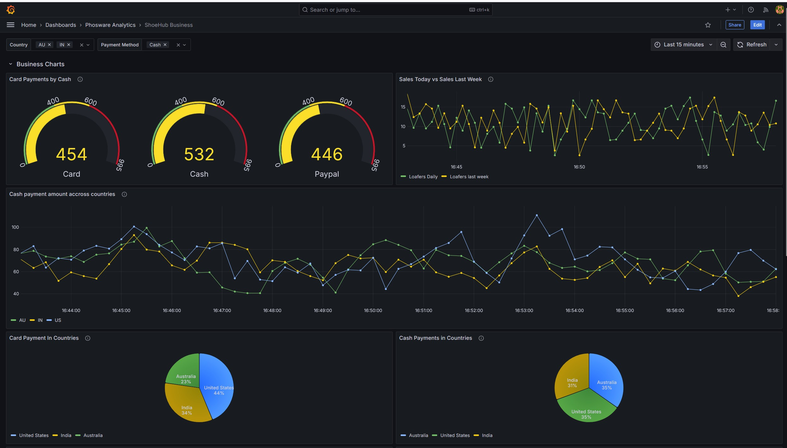
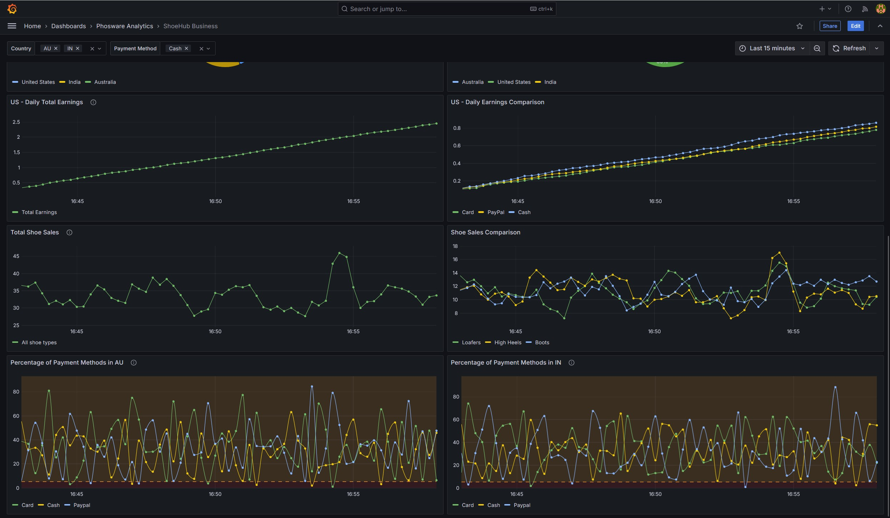
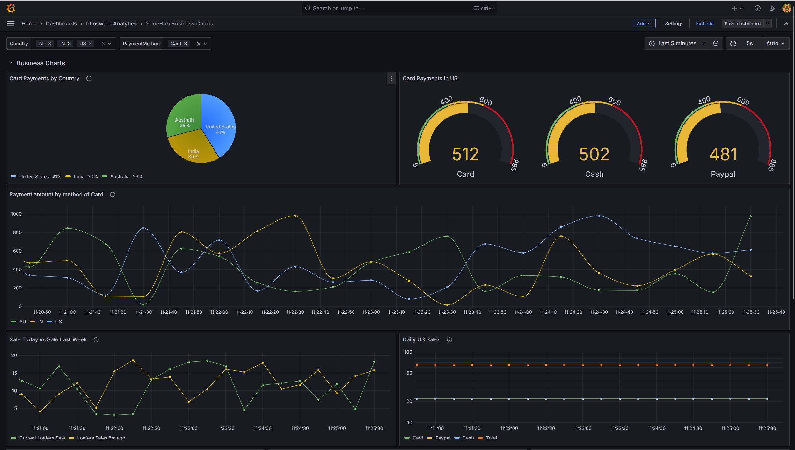
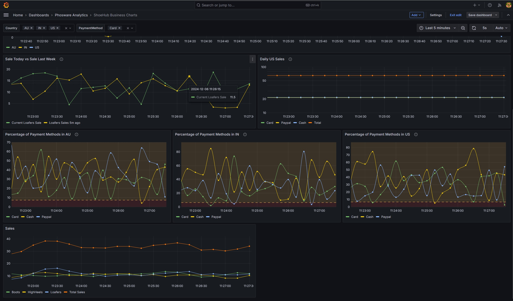

## Title 
Grafana dashboards for monitoring and visualization 

### Description
This project provides pre-configured Grafana dashboards for monitoring and visualization. It includes dynamic, multi-valued charts with various types such as time series, gauge, and pie charts. These dashboards are designed to display business metrics with filtering and thresholding capabilities, making them suitable for analyzing data like payment methods and geographical distribution

### Setup Instructions (Linux/Mac):
1. Clone the repo
2. Ensure your logged in user has write permissions to all the files and subdirectories in the repository folder. Run the following commands
    *  sudo chown -R [username]:[username] ./grafana-showcase-1 
    *  sudo chmod -R 755 ./grafana-showcase-1 
3. Run the following command
    * docker compose up -d 
4. Visit localhost:3000/, type the default username and password -  admin , admin; then create your password.
5. To view charts that come with this project, copy the contents of   ./dashboards/* into ./shared/grafana/provisioning/dashboards/
6. Visit the grafana Dashboard menu, search for ShoeHub Business or ShoeHub Business Charts to view the pre-made dashboards.

### Features:

* Dynamic Charts - can be filtered by country and payment methods
* MultiValued Charts - charts can be repeated by selecting multiple filter options
* Chart Types - time Series, guage, pie
* Charts with thresholds

The docker compose file contains the following services
   * grafana, prometheus, tempo, alloy, promtail and loki
   * In addition there are two application services that generate logs and metrics: orderservice, paymentservice. These metrics can be viewed in the shoehub web app at http://localhost:8001/metrics
   * Finally there's the stimulator image that triggers metrics in order service and payment service every 5 secs.
    
### Screenshots:

 #### Credits 
 A big thank you Aref Karimi for his amazing course. You can learn about PLG stack [here](https://www.udemy.com/course/grafana-graphite-and-statsd-visualize-metrics/?couponCode=ST19MT121224)
